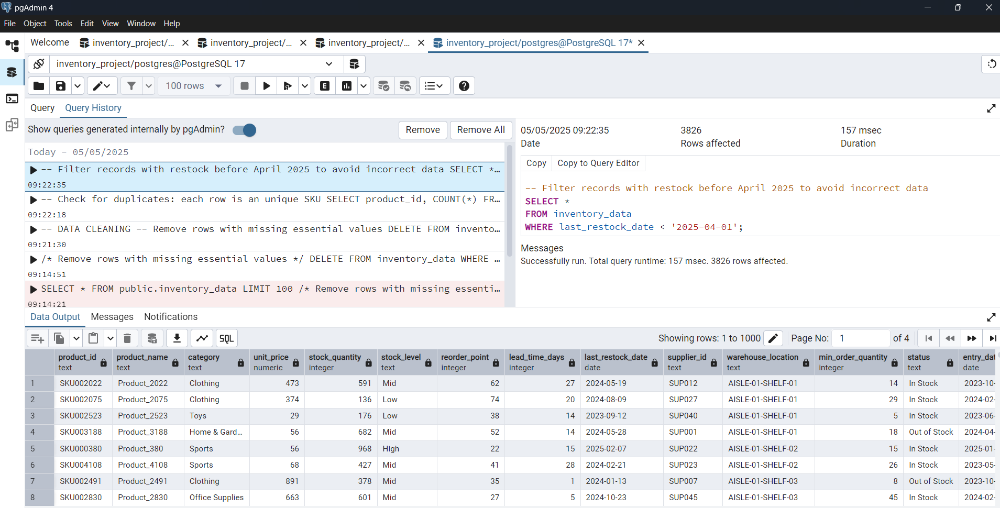
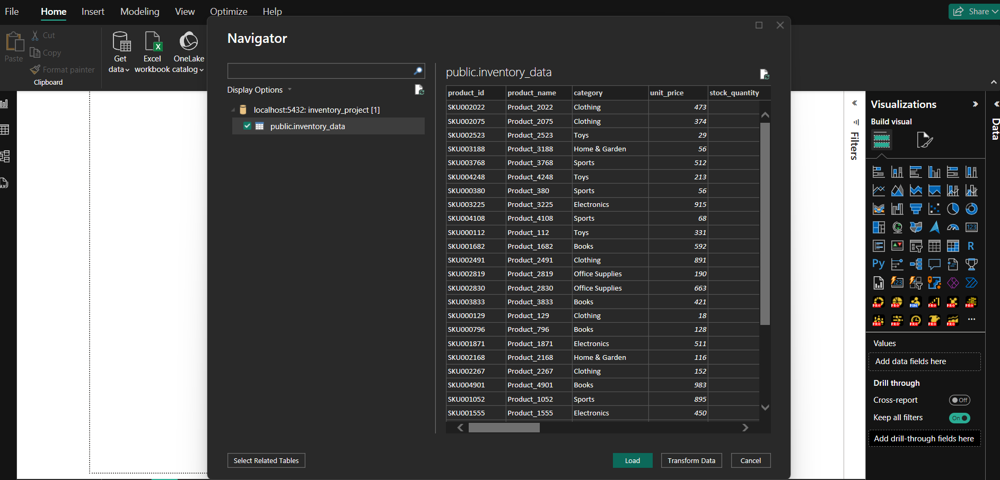
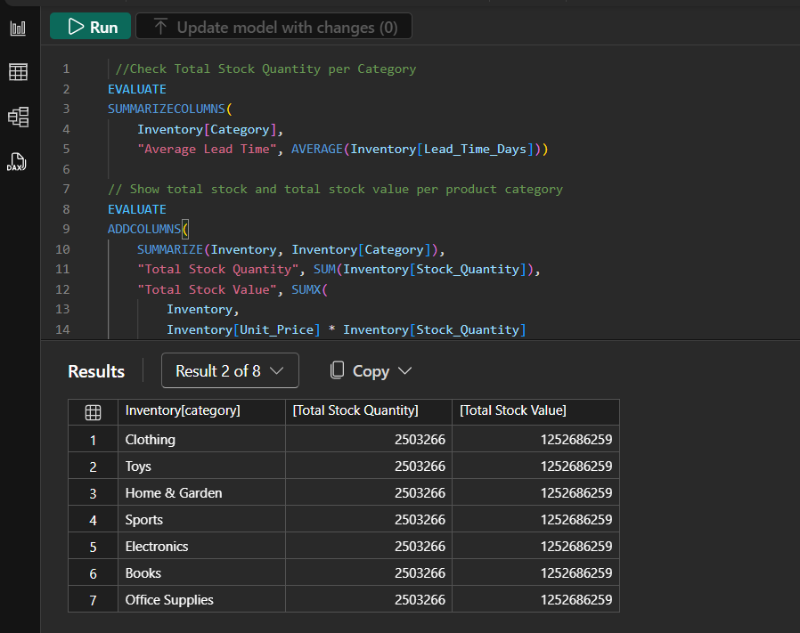
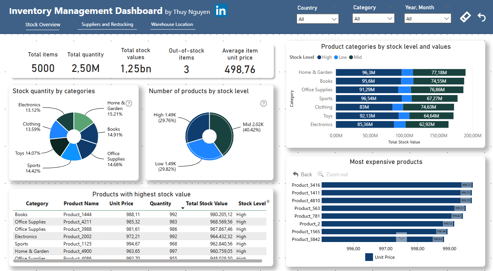
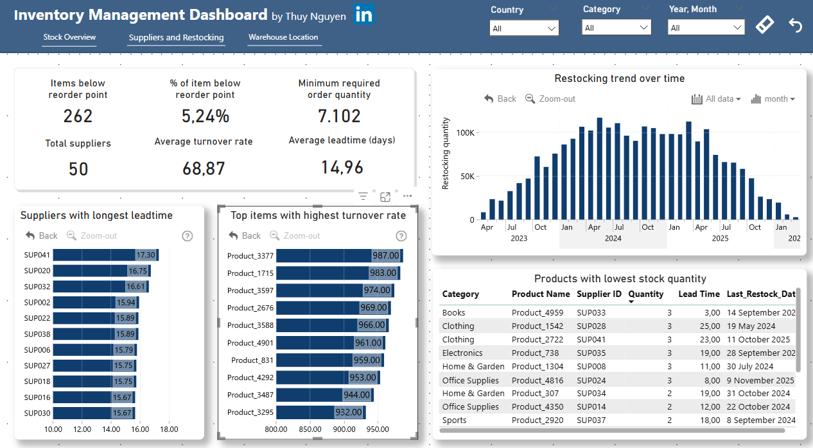

# 📦 FP20 Analytics Challenge 25 – Inventory Management Dashboard

This project was developed for the **FP20 Analytics Challenge 25**, hosted by [ZoomCharts](https://zoomcharts.com/en/microsoft-power-bi-custom-visuals/challenges/fp20-analytics-april-2025). It presents an interactive inventory management dashboard built in **Power BI**, with all data handled and transformed using **PostgreSQL**, **SQL**, and **DAX**.

---

## 🛠 Tools I Used

- **PostgreSQL** – Database creation and management
- **SQL** – Data cleaning, exploration, and aggregation
- **Power BI Desktop** – Visual dashboard design
- **DAX Queries** – Custom KPIs, calculated columns, and business logic verification.

---

## 📁 Project Highlights

- Cleaned and transformed raw inventory data using SQL. View SQL files here: main/Data_cleaning_and_exploration.sql
- Built relationships and KPIs in Power BI, using DAX query to verify logic and accuracy. View DAX queries here: main/DAX-query.txt
- Designed a 3-page interactive dashboard showing:
  - Stock overview
  - Supplier performance & restocking analysis
  - Warehouse location insights
- Check out and interact with my Power BI Dashboard here: https://lnkd.in/eBngvxtb

---

## 🔍 Key Insights

**1. Stock Overview**
- 5,000 products | 2.5M units | €1.25B in stock value
- 40% at mid stock level, 30% at low stock level
- Top categories: Home & Garden, Books, Office Supplies

**2. Product-Level Insights**
- Highest stock value products: Product_1444, 4211, 3988
- Most expensive items near €999 are high-value assets

**3. Supplier & Restocking**
- Avg lead time: 15 days | Max: 17.3 days
- 262 items below reorder point → 7,102 MOQ needed
- Turnover rate up to 987 — highlights fast-moving SKUs

**4. Warehouse Location Analysis**
- 989 warehouses across 10 countries
- Germany, Spain, and Belgium lead in stock volume
- Top high-density shelves > 8K units | Lowest < 200 units

---
## 🖼️ Project Screenshots & Workflow Overview
### 🔹 1. Writing SQL Queries in pgAdmin 4

Used pgAdmin to write queries for creating tables, cleaning the data, and running initial analysis.

---

### 🔹 2. Importing Data from PostgreSQL to Power BI

Connected Power BI to the PostgreSQL server and imported the cleaned dataset for modeling and visualization.

---

### 🔹 3. DAX Queries & Measures

Used DAX to verify the logic and accuracy of some measures

  

---

### 🔹 4. Final Power BI Dashboard

A multi-page dashboard showing stock levels, supplier lead times, reorder analysis, and warehouse performance.

